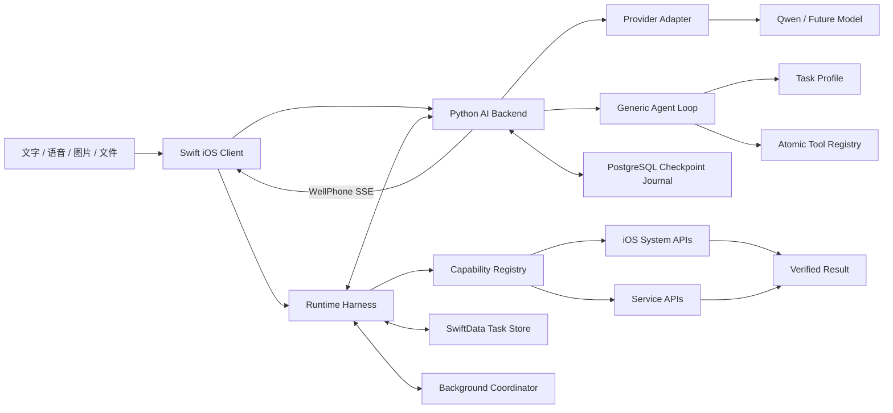

# WellPhone Silent Agent

一个面向 iPhone 的无界面多模态 Agent。用户通过文字、语音、图片或文件下达任务后，可以继续使用当前 App；Agent 在 iOS 允许的后台执行窗口内完成推理、文件处理、系统能力调用和服务 API 操作，全程不抢占屏幕、键盘或输入焦点。

> 当前阶段：设备端与服务端 Harness 已贯通。`reminder.create` 在 iPhone 上确认、执行并验证；服务端长任务由 LangGraph 统一 Agent Loop 驱动，`travel.plan` 只提供任务 Profile 与原子 Tool 白名单。聊天已支持相册图片选择、发送前预览、本地附件持久化，以及 Qwen 兼容的多模态 Content Parts。聊天请求、权威对话历史、Tool Result、任务检查点、服务端任务租约、Loop 事件与产物均由 PostgreSQL 协调。

## 核心原则

- **屏幕属于用户**：任务启动后不主动创建前台 Scene、拉起其他 App 或显示键盘。
- **模型只做决策**：模型生成结构化计划，确定性工具负责真实执行。
- **结果必须验证**：工具执行成功后读取系统或服务端状态进行二次校验。
- **任务可以恢复**：每一步持久化，App 被暂停或终止后能够幂等恢复。
- **能力严格受限**：仅执行白名单工具；付款、删除及未授权外发默认禁止。

## 架构



## 开发路线

1. **V0 聊天**：SwiftUI 多轮聊天、流式响应、本地历史、停止与重试。
2. **V0.1 最小 Agent**：实现 `reminder.create`，完成计划、授权、执行和验证闭环。
3. **V0.2 任务系统**：任务状态机、检查点、幂等、失败重试和恢复。
4. **V0.3 多模态**：图片选择、预览和 Qwen 图文输入已完成；语音、PDF 与 OCR 待扩展。
5. **V0.4 服务端长任务**：PostgreSQL 队列、任务租约、worker、重试、进度与产物已完成。
6. **V0.5 旅行规划**：通用 Agent Loop 自主调用地点检索与行程提交 Tool，Apple 地图地点核对/打开链接、文本与日历事件产物已完成。

## 技术栈

- iOS：Swift 6、SwiftUI、Swift Concurrency、SwiftData、App Intents、BackgroundTasks
- 系统能力：PhotoKit、Vision、PDFKit/Core Graphics、EventKit、Keychain、OSLog
- 网络：URLSession、Background URLSession、OAuth 2.0
- 服务端：Python 3.12+、FastAPI、LangGraph、Provider Adapter、结构化输出校验、请求租约、权威会话历史与响应回放
- 数据库：PostgreSQL 18、Psycopg 3 异步连接池
- 模型：支持多模态输入、JSON Schema/结构化输出与工具调用的模型

## 启动 Python AI 后端

先复制服务端环境变量示例：

```bash
cd server
cp .env.example .env
```

然后在 `server/.env` 中填写以下三项：

```dotenv
DASHSCOPE_API_KEY=
QWEN_BASE_URL=
QWEN_MODEL=
# 可选：启用 Apple Maps Server API 的真实地点与坐标核对
APPLE_MAPS_TOKEN=
```

`QWEN_BASE_URL` 必须与 API Key 所在地域一致，并以 `/compatible-mode/v1` 结尾。

本地开发需要 Python 3.12 或更高版本以及 [uv](https://docs.astral.sh/uv/)：

```bash
docker compose up -d postgres
uv sync
uv run python -m app
```

真机联调或本机常驻部署推荐使用 Docker：

```bash
docker compose up -d --build
docker compose ps
docker compose logs -f ai-backend
```

停止服务时运行 `docker compose down`。Compose 会同时管理 FastAPI、独立长任务 worker 和 PostgreSQL，并等待数据库健康后再启动服务。模型密钥在运行时从 `server/.env` 注入，不会复制进镜像；容器以非 root 用户和只读文件系统运行，PostgreSQL 数据保存在 `wellphone-postgres` Docker Volume 中。

iOS 客户端从 `ios/WellPhone/WellPhone/Resources/Configuration/AppConfig.json` 读取代理地址。真机联调时，将服务端 `HOST` 改为 `0.0.0.0`，并把 `modelProxyBaseURL` 改成运行代理的 Mac 局域网地址，例如 `http://192.168.1.20:8787`。该模式仅用于受信任的开发网络；正式部署应使用 HTTPS 和服务端认证。

API Key 只存在于 `server/.env`，不会进入客户端或 Git。

测试提醒链路时，可以发送“请提醒我明天上午九点带伞”。后端返回的操作会先显示为确认卡片；点击“确认创建”后，App 才会请求提醒事项权限并执行。修改服务端代码后，本地开发模式需要重新启动 `uv run python -m app`；Docker 模式需要重新运行 `docker compose up -d --build`。

测试旅行链路时，可以发送“帮我规划 2026 年 10 月 1 日到 3 日的上海旅行，节奏轻松，喜欢博物馆和咖啡”。确认后即使离开聊天页面，worker 也会继续运行统一 Agent Loop；模型根据目标自主选择地点检索 Tool，提交 Tool 负责确定性校验，校验失败会以 Observation 返回循环修订。任务详情会展示阶段进度，以及结构化行程、文本版和日历事件产物。未填写 `APPLE_MAPS_TOKEN` 时会生成 Apple 地图检索链接；填写后会通过 Apple Maps Server API 核对地点与坐标。

首次产生需要确认的任务时，系统会请求通知权限。允许后，WellPhone 会在任务等待确认以及任务完成并通过验证时发送本地通知；点击通知会进入任务中心。拒绝通知权限不会阻止任务执行，任务状态仍会保存在 App 内。

## 项目边界

本项目不是 iOS 跨 App UI 自动化工具。未越狱 iPhone 不支持在后台创建第二套交互式 UI 会话，也不能读取或操纵任意第三方 App。WellPhone 通过系统 Framework、App Intent 和业务 API 完成任务。

当前源码目录、模块职责和依赖规则参见 [架构说明](docs/ARCHITECTURE.md)。分层测试命令、覆盖矩阵和提交前标准参见 [测试策略](docs/TESTING.md)。详细设计、数据模型、接口约定和实施计划参见 [开发文档](docs/DEVELOPMENT.md)，Tool 与执行外壳的边界参见 [Runtime Harness](docs/RUNTIME_HARNESS.md)，V0.2 的完成范围和验证证据参见 [V0.2 验收记录](docs/V0_2_ACCEPTANCE.md)。
