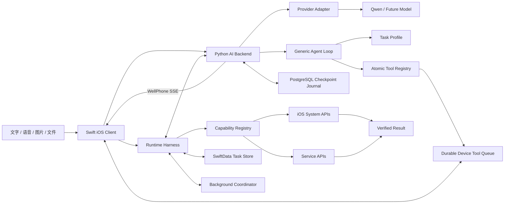

# WellPhone Silent Agent

一个面向 iPhone 的无界面多模态 Agent。用户通过文字、语音、图片或文件下达任务后，可以继续使用当前 App；Agent 在 iOS 允许的后台执行窗口内完成推理、文件处理、系统能力调用和服务 API 操作，全程不抢占屏幕、键盘或输入焦点。

> 当前阶段：设备端与服务端 Harness 已贯通。`reminder.create` 在用户明确下达指令后直接执行并验证；服务端长任务由 LangGraph 统一 Agent Loop 驱动。`business-trip.plan` 已支持从文字、订单图片、带文字层的 PDF/TXT/Markdown 文件或用户明确授权的 Gmail（含 PDF/ICS/文本附件）中提取固定安排；读取 Apple 日历检查冲突；通过原生 MapKit 核验地点并计算真实交通路线；在相册图片上执行本地 Vision OCR，生成去重后的报销清单；最终写入带值机/出发提醒的 Apple 日历，并把行程 PDF 与报销 PDF 分别上传 Google Drive、回读验证后通知完成。Google OAuth token 由官方 iOS SDK 保存在设备钥匙串，不进入服务端任务状态。

## 核心原则

- **屏幕属于用户**：任务启动后不主动创建前台 Scene、拉起其他 App 或显示键盘。
- **模型只做决策**：模型生成结构化计划，确定性工具负责真实执行。
- **结果必须验证**：工具执行成功后读取系统或服务端状态进行二次校验。
- **任务可以恢复**：每一步持久化，App 被暂停或终止后能够幂等恢复。
- **能力严格受限**：仅执行白名单工具；付款、删除及未授权外发默认禁止。

## 架构



## 开发路线

1. **V0 聊天**：SwiftUI 多轮聊天、流式响应、本地历史、停止与重试。
2. **V0.1 最小 Agent**：实现 `reminder.create`，完成计划、授权、执行和验证闭环。
3. **V0.2 任务系统**：任务状态机、检查点、幂等、失败重试和恢复。
4. **V0.3 多模态**：图片选择、预览、Qwen 图文输入、设备端语音转写，以及 PDF/TXT/Markdown 文件选择和文字提取已完成；扫描件 OCR 与 Share Extension 待扩展。
5. **V0.4 服务端长任务**：PostgreSQL 队列、任务租约、worker、重试、进度与产物已完成。
6. **V0.5 旅行规划**：通用 Agent Loop 自主调用地点检索与行程提交 Tool，Apple 地图地点核对/打开链接、文本与日历事件产物已完成。
7. **V0.6 商务出差任务包**：固定订单/会议提取、原时间保护、地点核对、冲突识别、待办与日历提醒产物、Gmail 只读取证、Drive 幂等 PDF 上传和真实账号端到端验收已完成；带文字层的 PDF/TXT/Markdown 凭证可直接作为聊天附件，扫描件 OCR 待扩展。

## 技术栈

- iOS：Swift 6、SwiftUI、Swift Concurrency、SwiftData、App Intents、BackgroundTasks
- 系统能力：PhotoKit、Vision、PDFKit/Core Graphics、EventKit、Keychain、OSLog
- 网络：URLSession、Background URLSession、OAuth 2.0
- 服务端：Python 3.12+、FastAPI、LangGraph、Provider Adapter、结构化输出校验、请求租约、权威会话历史与响应回放
- 数据库：PostgreSQL 18、Psycopg 3 异步连接池
- 模型：支持多模态输入、JSON Schema/结构化输出与工具调用的模型

## 启动 Python AI 后端

先复制服务端环境变量示例：

```bash
cd server
cp .env.example .env
```

然后在 `server/.env` 中填写以下三项：

```dotenv
DASHSCOPE_API_KEY=
QWEN_BASE_URL=
QWEN_MODEL=
# 可选备用；默认由 iPhone 原生 MapKit 无 token 核对地点
APPLE_MAPS_TOKEN=
```

`QWEN_BASE_URL` 必须与 API Key 所在地域一致，并以 `/compatible-mode/v1` 结尾。

本地开发需要 Python 3.12 或更高版本以及 [uv](https://docs.astral.sh/uv/)：

```bash
docker compose up -d postgres
uv sync
uv run python -m app
```

真机联调或本机常驻部署推荐使用 Docker：

```bash
docker compose up -d --build
docker compose ps
docker compose logs -f ai-backend
```

停止服务时运行 `docker compose down`。Compose 会同时管理 FastAPI、独立长任务 worker 和 PostgreSQL，并等待数据库健康后再启动服务。模型密钥在运行时从 `server/.env` 注入，不会复制进镜像；容器以非 root 用户和只读文件系统运行，PostgreSQL 数据保存在 `wellphone-postgres` Docker Volume 中。

iOS 客户端从 `ios/WellPhone/WellPhone/Resources/Configuration/AppConfig.json` 读取代理地址。真机联调时，将服务端 `HOST` 改为 `0.0.0.0`，并把 `modelProxyBaseURL` 改成运行代理的 Mac 局域网地址，例如 `http://192.168.1.20:8787`。该模式仅用于受信任的开发网络；正式部署应使用 HTTPS 和服务端认证。

API Key 只存在于 `server/.env`，不会进入客户端或 Git。

测试提醒链路时，可以发送“请提醒我明天上午九点带伞”。明确的创建指令会直接进入执行，聊天中显示进度，完成后收起为精简卡片并生成基于真实结果的自然语言回复。首次使用时仍由 iOS 显示系统权限请求。修改服务端代码后，本地开发模式需要重新启动 `uv run python -m app`；Docker 模式需要重新运行 `docker compose up -d --build`。

测试旅行链路时，可以发送“帮我规划 2026 年 10 月 1 日到 3 日的上海旅行，节奏轻松，喜欢博物馆和咖啡”。任务会立即开始，即使离开聊天页面，worker 也会继续运行统一 Agent Loop；地点检索由服务端持久化为 Device Tool，iPhone 在持续后台任务中通过无界面的原生 MapKit 搜索并回传名称、地址、坐标与 Place ID，全程不打开地图或抢焦点。未核对或存在歧义的地点不能通过行程提交校验；`APPLE_MAPS_TOKEN` 仅作为设备长时间无响应时的可选服务端备用。若用户明确要求“并添加到日历”，完成后会直接、幂等地写入 Apple 日历，并在逐项回读验证成功后才将整个任务标记为完成；未明确要求时，完成后才显示日历选择弹窗。

测试商务出差链路时，可以使用 [上海出差演示资料](fixtures/business-trip/shanghai-demo.txt)。聊天模型会把其中的航班、酒店和会议转换为不可擅自改动的固定安排；后台 Agent 可以补充交通和空档，但提交前必须保留全部固定事项及其原始时间，并通过 Apple 地图核对具体地点。每段交通都必须引用手机端 MapKit 返回的路线和预计时长。任务会确定性标记固定事项及现有日历事件的时间冲突；全天节假日只作为背景信息，不会错误阻塞整天。只有用户明确要求写入日历时才会执行 EventKit 写入；明确要求提醒时，航班日历事件默认包含提前 24 小时值机提醒和提前 3 小时出发提醒，其他安排按类型添加提醒，并在写入后回读验证。

也可以点击输入框旁的 `+`，选择照片或文件。文件支持最多 3 个 PDF、TXT 或 Markdown；图片支持最多 4 张。原件只保存在设备端：PDFKit/文本解码负责文件文字层，Apple Vision 负责所选相册图片的本地 OCR，提取结果均以独立的不可信证据边界发送给模型。单个文件上限 10 MB，单个文件最多 20000 字、每条消息的文件文字合计最多 24000 字。没有文字层的扫描版 PDF 会被明确拒绝，应将页面作为图片从相册选择。

### 配置 Gmail 与 Google Drive

WellPhone 使用 Google 官方 iOS Sign-In SDK。先在 Google Cloud 中为 `com.michaelnan.WellPhone` 创建 iOS OAuth 客户端，并启用 Gmail API 与 Google Drive API；开发期把测试账号加入 OAuth 同意屏幕的测试用户。然后在 WellPhone target 的 Debug/Release Build Settings 中填写：

```text
GID_CLIENT_ID = 你的 iOS OAuth Client ID
GOOGLE_REVERSED_CLIENT_ID = Google Cloud 提供的 iOS URL scheme
```

Client ID 不是客户端密钥，但不要提交任何访问令牌、刷新令牌或测试邮箱内容。首次执行明确包含“从 Gmail 查找”的出差任务时，App 会显示 Google 同意页面并只请求 `gmail.readonly`；只有用户明确要求“上传到 Google Drive”时才使用 `drive.file`。聊天模型只记录 `searchGmail=true`，服务端再按目的地和出差日期生成不可扩大的 `gmailQuery`；默认邮件接收时间范围为出发前 180 天至返程后一周，不添加 `from:me` 或 `to:me`。每个抽取出的订单或会议还必须引用真实的 Gmail message ID。Gmail 返回结果会同时提取受支持的 PDF、ICS 和文本附件文字，单个附件失败不会隐藏其他邮件证据。Drive 文件按“任务 + 文件类型”分别幂等查找，手机将计划和报销清单分页渲染为两个 PDF，上传后下载内容进行逐字节验证；聊天完成回复会分段展示行程，并附带两个已验证的 Drive 链接。

面向用户的测试输入应保持自然语言，不要求用户了解 Gmail 搜索操作符。例如：

> 请帮我整理 2026 年 10 月 1 日到 3 日的上海出差。从我的 Gmail 中找出与这次出差有关的机票、酒店和会议邮件，保留其中的真实时间和地点，检查冲突并补充必要交通，最后把计划上传到 Google Drive。

完整能力验收时，在同一条消息中通过 `+` 选择票据照片，再发送：

> 帮我处理下周上海出差：从 Gmail 找出机票、酒店和会议确认；结合日历检查冲突；补全地址和交通安排；把行程写入日历并设置值机、出发提醒；从我选择的票据图片中生成行程单和报销清单；把文件保存到 Google Drive，完成后通知我。

服务端会根据目的地和日期范围生成 `gmailQuery`；该查询一旦写入任务输入就不能被后台 Agent 扩大。没有真实订单邮件的测试账号，可以把 [Gmail 商务出差测试邮件](fixtures/business-trip/gmail-test-messages.md) 中的四封模拟邮件分别发送给自己；邮件内容仍是模拟资料，但会获得真实 Gmail message ID，适合端到端验收。

允许通知权限后，WellPhone 会在任务完成并通过验证时发送本地通知；点击通知会进入任务中心。拒绝通知权限不会阻止任务执行，任务状态仍会保存在 App 内。

## 配置系统语音唤醒

WellPhone 通过 iOS Vocal Shortcuts 暴露“开始语音对话”操作，因此用户在其他 App 中也可以用自定义短语唤醒，而不需要 WellPhone 持续在后台监听麦克风。

1. 在真机安装并至少启动一次 WellPhone，让系统发现 App Shortcut。
2. 打开“设置 → 辅助功能 → 语音快捷指令（Vocal Shortcuts）”，添加新的语音快捷指令。
3. 在动作列表中选择 WellPhone 的“开始语音对话”，录入自定义唤醒短语。
4. 首次唤醒时允许 WellPhone 使用麦克风；首次使用某个语言也可能需要下载设备端语音模型。

触发后，系统会将 WellPhone 带到前台并自动进入语音对话页。实时转写由 iOS `SpeechAnalyzer` 在设备端完成，用户确认文字后再发送给 Agent。冷启动请求会短暂持久化，避免 App 启动过程丢失本次唤醒。锁屏状态能否直接进入录音页仍受设备的解锁和安全策略控制，需要在目标真机上验收。

## 项目边界

本项目不是 iOS 跨 App UI 自动化工具。未越狱 iPhone 不支持在后台创建第二套交互式 UI 会话，也不能读取或操纵任意第三方 App。WellPhone 通过系统 Framework、App Intent 和业务 API 完成任务。

当前源码目录、模块职责和依赖规则参见 [架构说明](docs/ARCHITECTURE.md)。分层测试命令、覆盖矩阵和提交前标准参见 [测试策略](docs/TESTING.md)。详细设计、数据模型、接口约定和实施计划参见 [开发文档](docs/DEVELOPMENT.md)，Tool 与执行外壳的边界参见 [Runtime Harness](docs/RUNTIME_HARNESS.md)，V0.2 的完成范围和验证证据参见 [V0.2 验收记录](docs/V0_2_ACCEPTANCE.md)。
