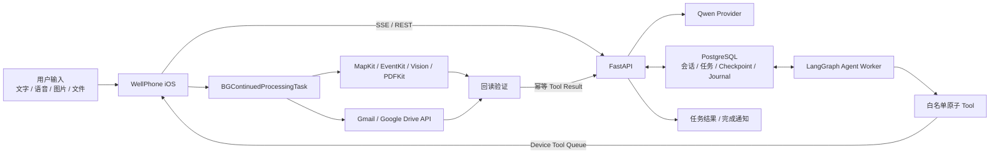

# WellPhone Silent Agent

WellPhone 是一个运行在 iPhone 上的后台 Agent。用户在 WellPhone 中通过文字、语音、图片或文件发起任务后，可以切换到其他 App 继续正常使用手机；Agent 使用服务端模型完成规划，并通过 iPhone 原生 Framework 与已授权的服务 API 执行、回读和验证结果，不接管前台画面、键盘或输入焦点。

当前推荐演示任务是旅行规划：用户提交目的地、日期和偏好后切换到其他 App，服务端 Agent Loop 继续规划，iPhone 在 `BGContinuedProcessingTask` 中无界面调用 MapKit 核验地点，完成后通过本地通知返回结果。商务出差任务在此基础上扩展了 Gmail 取证、Apple 日历冲突检查、路线计算、票据 OCR、双 PDF 和 Google Drive 上传。

## 为什么采用这条路线

iOS 不允许普通 App 在后台控制另一个 App 的 UI，也不存在第二套独立的屏幕、焦点和键盘会话。WellPhone 因此不做跨 App 点击自动化，而是把任务拆成两类工作：

- 服务端负责模型推理、任务队列、Agent Loop、重试和持久化。
- iPhone 负责只有设备才能安全完成的能力，例如 MapKit、EventKit、Vision、本地文件和设备侧 OAuth。
- 模型只能调用白名单中的结构化 Tool；系统或服务写入必须经过确定性校验和真实回读，不能由模型直接宣称成功。

这使用户继续使用手机时，Agent 不需要打开地图、日历、Gmail 或 Drive App，也不会注入点击或抢占键盘。

## 架构



任务状态同时保存在 SwiftData 和 PostgreSQL 中。服务端使用租约避免多个 worker 重复执行；设备 Tool、Checkpoint 和 Tool Result 使用稳定标识去重。App 或网络中断后会从已保存状态恢复，而不是从头重放已经确认的副作用。

## 已实现能力

| Capability | 执行位置 | 完成条件 |
|---|---|---|
| `reminder.create` | iPhone / EventKit | 创建后回读提醒事项字段 |
| `travel.plan` | 服务端 Agent + iPhone MapKit | 所有地点通过 MapKit 核验，按需写入并回读日历 |
| `business-trip.plan` | 服务端 Agent + iPhone 原生能力/Google API | 保留固定安排，校验冲突与路线，按授权生成日历、PDF 和 Drive 结果 |

输入支持多轮文字、设备端语音转写、最多 4 张图片以及最多 3 个带文字层的 PDF/TXT/Markdown 文件。图片使用 Apple Vision 本地 OCR；扫描 PDF 没有文字层时会明确失败，需将页面作为图片选择。

## 部署

### 环境要求

- macOS + Xcode 26.4
- iPhone，系统版本不低于 iOS 26.4
- Docker Desktop；或 Python 3.12+ 与 [uv](https://docs.astral.sh/uv/)
- 支持多模态输入与 Tool Calling 的 Qwen 模型，以及对应的百炼 API Key
- Mac 与 iPhone 位于同一个受信任局域网

### 1. 配置并启动服务端

```bash
cd server
cp .env.example .env
```

至少填写以下变量：

```dotenv
DASHSCOPE_API_KEY=your-api-key
QWEN_BASE_URL=https://your-workspace.cn-beijing.maas.aliyuncs.com/compatible-mode/v1
QWEN_MODEL=your-model-name
```

推荐用 Docker Compose 同时启动 PostgreSQL、API 和长任务 worker：

```bash
docker compose up -d --build
docker compose ps
curl http://127.0.0.1:8787/health
```

健康检查应返回 `"status":"ok"`。停止服务使用 `docker compose down`；不要加 `-v`，除非确实要删除本地 PostgreSQL 数据。

不用 Docker 时，需要分别启动 API 和 worker：

```bash
cd server
uv sync
docker compose up -d postgres
uv run --env-file .env python -m app
```

另开一个终端：

```bash
cd server
uv run --env-file .env python -m app.bootstrap.worker
```

### 2. 配置 iPhone 客户端

将 [`AppConfig.json`](ios/WellPhone/WellPhone/Resources/Configuration/AppConfig.json) 中的 `modelProxyBaseURL` 改为运行服务端的 Mac 局域网地址，例如：

```json
{
  "modelProxyBaseURL": "http://192.168.1.20:8787"
}
```

然后打开 [`WellPhone.xcodeproj`](ios/WellPhone/WellPhone.xcodeproj)，选择开发团队和目标 iPhone，确认 Bundle Identifier 与签名配置可用后运行。HTTP 局域网模式只用于现场演示或受信任开发网络；正式部署应改为 HTTPS 并增加服务端身份认证。

### 3. 演示前授权

为了保证任务执行期间不弹出授权页面，应在演示前完成任务会用到的权限：

- 允许 WellPhone 发送完成通知。
- 需要读取或写入日历时，提前授予 Apple 日历完整访问权限。
- 使用 Gmail/Drive 时，提前登录 Google 账号并授予对应 Scope。
- 使用语音输入时，提前允许麦克风与语音识别。

Google 能力使用官方 Google Sign-In iOS SDK。部署到自己的 Bundle Identifier 时，需要在 Google Cloud 创建 iOS OAuth Client、启用 Gmail API 和 Google Drive API，并在 target Build Settings 中配置：

```text
GID_CLIENT_ID = your-ios-client-id.apps.googleusercontent.com
GOOGLE_REVERSED_CLIENT_ID = com.googleusercontent.apps.your-ios-client-id
```

Gmail 只申请 `gmail.readonly`，Drive 只申请 `drive.file`。OAuth token 由 SDK 保存在设备侧，不上传到 WellPhone 服务端。

## 环境变量

| 变量 | 必填 | 默认值 | 用途 |
|---|---:|---|---|
| `DASHSCOPE_API_KEY` | 是 | — | 百炼 API Key，仅存于服务端 |
| `QWEN_BASE_URL` | 是 | — | 与 Key 地域一致的 HTTPS 兼容接口 |
| `QWEN_MODEL` | 是 | — | 支持多模态和 Tool Calling 的模型名 |
| `DATABASE_URL` | 否 | 本地 PostgreSQL | 服务端持久化连接串 |
| `HOST` / `PORT` | 否 | `127.0.0.1` / `8787` | API 监听地址与端口；Compose 自动使用 `0.0.0.0` |
| `APPLE_MAPS_TOKEN` | 否 | 空 | iPhone MapKit 超时后的服务端备用路径 |
| `MAX_REQUEST_BYTES` | 否 | `26214400` | 单次请求大小上限 |
| `CHAT_REQUEST_LEASE_SECONDS` | 否 | `150` | 聊天请求幂等租约 |
| `CONVERSATION_CONTEXT_MESSAGES` | 否 | `40` | 服务端上下文消息数上限 |
| `CONVERSATION_CONTEXT_CHARACTERS` | 否 | `32000` | 服务端上下文字符数上限 |
| `CONTINUATION_LEASE_SECONDS` | 否 | `150` | Tool Result 续接租约 |
| `TASK_WORKER_LEASE_SECONDS` | 否 | `300` | 长任务 worker 租约 |
| `TASK_WORKER_POLL_SECONDS` | 否 | `2` | worker 队列轮询间隔 |
| `TASK_WORKER_MAX_ATTEMPTS` | 否 | `3` | 服务端任务最大执行次数 |
| `POSTGRES_DB/USER/PASSWORD` | 否 | Compose 开发值 | Docker Compose PostgreSQL 配置 |

完整示例见 [`server/.env.example`](server/.env.example)。不要提交 `.env`、OAuth token、用户邮件、票据或其他真实隐私数据。

## 演示

### 核心无打扰演示

1. 启动服务端，确认 `/health` 正常，并在 iPhone 打开 WellPhone。
2. 输入：`帮我规划 2026 年 10 月 20 日到 22 日的上海旅行，节奏轻松，喜欢博物馆和咖啡。`
3. 任务卡片开始显示进度后，立即切换到设置、信息流或聊天 App，并持续滑动、输入和切换页面。
4. WellPhone 在后台完成 Qwen 规划和手机端 MapKit 核验；整个过程不打开地图、不抢焦点或键盘。
5. 收到“任务已完成”通知后返回 WellPhone，检查任务步骤、结构化行程和地图链接。

如需演示真实系统写入，可在指令末尾增加“并添加到 Apple 日历”；只有 EventKit 写入并逐项回读成功后，任务才会显示完成。

### 商务出差完整测试包

仓库提供可直接复现复杂任务的 [`上海出差完整测试包`](fixtures/business-trip/shanghai-test-pack/README.md)，其中包含：

- 4 份带文字层的机票、酒店和会议 PDF；
- 6 封含 PDF/ICS 附件的 Gmail 测试邮件；
- 5 个会议及冲突日历事件；
- 3 张票据图片，其中两张用于验证重复票据去重；
- 完整自然语言 Prompt、期望结果和 SHA-256 校验文件。

按照测试包说明准备测试 Gmail、日历和相册后，将 [`TEST-PROMPT.txt`](fixtures/business-trip/shanghai-test-pack/TEST-PROMPT.txt) 的内容发送给 WellPhone。该流程会访问真实 Gmail、日历和 Drive，必须使用专门的测试账号并提前完成全部授权。可通过 [`EXPECTED-RESULTS.md`](fixtures/business-trip/shanghai-test-pack/EXPECTED-RESULTS.md) 核对固定安排、会议改期、时间冲突、路线、票据去重、费用汇总和双 PDF Drive 交付结果。

## 验证

```bash
cd server
.venv/bin/pytest -q

cd ../ios/WellPhone
xcodebuild -project WellPhone.xcodeproj -scheme WellPhone \
  -destination 'generic/platform=iOS' \
  -configuration Debug build CODE_SIGNING_ALLOWED=NO
```

当前回归结果：服务端 `153 passed, 5 skipped`，跳过项为需要独立测试数据库的 PostgreSQL 契约测试；iOS 无签名构建和模拟器单元测试通过。核心后台完成流程已在目标 iPhone 上验证；更换网络、模型或授权配置后，应重新执行上述真机演示。

## 边界

- 不读取其他 App 的屏幕或辅助功能树。
- 不向第三方 App 注入点击、滑动或键盘输入。
- 不绕过系统权限、Face ID、OAuth 或第三方确认。
- 用户从 App Switcher 强制关闭 WellPhone，或系统结束后台执行窗口时，设备侧工作可能暂停；已持久化的任务会在 App 再次运行后恢复。
- 付款、购买、删除账户和批量外发不属于当前能力范围。

更多实现细节见 [`docs/ARCHITECTURE.md`](docs/ARCHITECTURE.md)、[`docs/RUNTIME_HARNESS.md`](docs/RUNTIME_HARNESS.md)、[`docs/TESTING.md`](docs/TESTING.md) 和 [`docs/DEVELOPMENT.md`](docs/DEVELOPMENT.md)。
