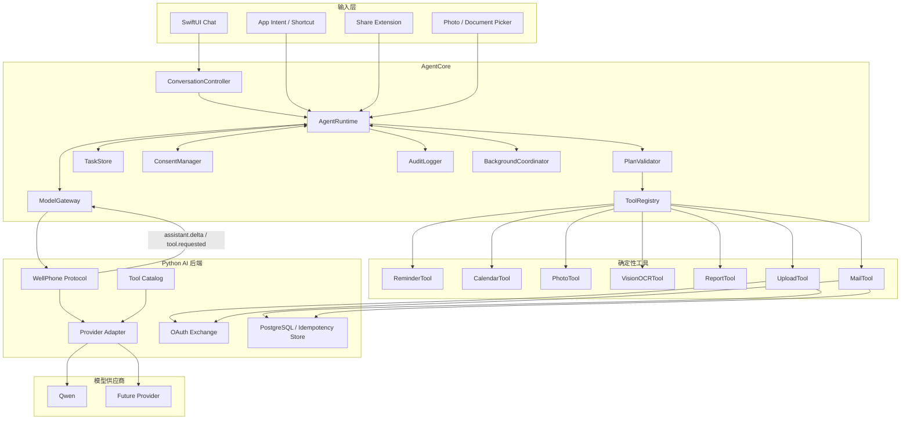
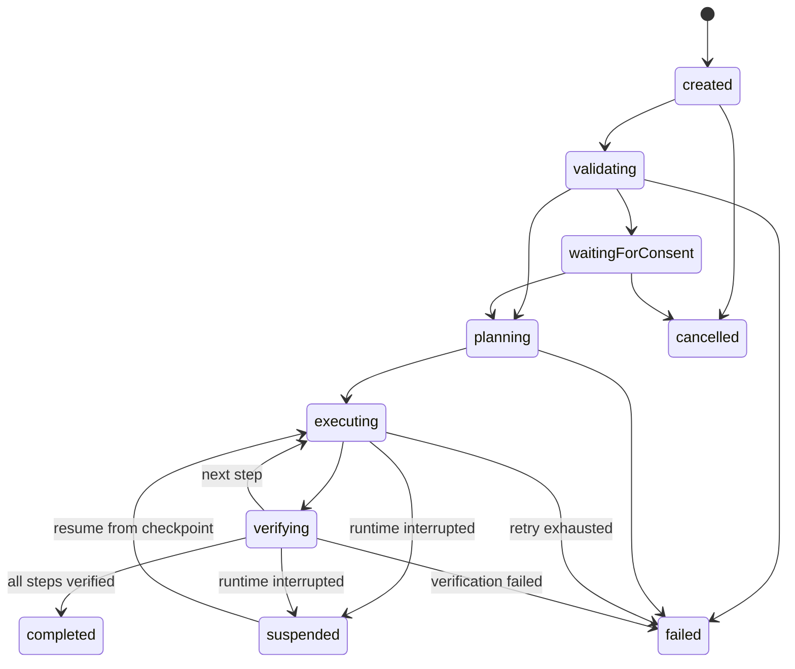

# WellPhone Silent Agent 开发文档

## 1. 文档状态

| 项目 | 当前值 |
|---|---|
| 目标设备 | iPhone 12 |
| iOS 版本 | 26.6.2 |
| Xcode / SDK | Xcode 26.4 / iOS SDK 26.4 |
| Swift 编译器 | Swift 6.3；工程当前 Language Mode 为 Swift 5，V0 开始前切换为 Swift 6 |
| 最低部署版本 | iOS 26.4 |
| 当前阶段 | V0.2 可恢复任务运行时已于 2026-09-11 完成；下一阶段为 V0.3 多模态输入 |
| 首个真实工具 | `reminder.create` |
| 首个完整业务任务 | 票据整理与报销报告 |

### 1.1 已确定的兼容性决策

1. 保留工程当前的 `IPHONEOS_DEPLOYMENT_TARGET = 26.4`。设备系统 26.6.2 高于最低部署版本，可以安装该 App。
2. 使用 Xcode 26.4 和 iOS 26.4 SDK 开发。Apple 的 Xcode 26.4 说明支持 iOS 15 及以上真机调试；首次连接 26.6.2 设备时，如 Xcode 要求下载组件，应先完成下载。如仍无法配对，再升级 Xcode，而不是修改业务代码。
3. V0 开始前将 Swift Language Mode 切换为 Swift 6；当前 Xcode 包含 Swift 6.3 编译器。
4. 后台主路径使用 `BGContinuedProcessingTask`：任务由用户明确操作触发，并允许在用户离开 App 后继续。
5. Background URLSession 负责文件上传和下载。
6. `LongRunningIntent` 当前仍按实验能力管理，只在 App Intent 阶段真机验证通过后启用，不作为 V0/V0.1 的依赖。
7. 普通 `BGProcessingTask` 仅用于维护或稍后调度，不作为“用户正在使用手机时完成任务”的核心路径。

### 1.2 开发前真机 Spike

业务开发前仍需完成一次小型真机验证：

1. Xcode 成功识别、签名并安装到 iPhone 12。**已于 2026-09-10 验证。**
2. 提交一个 `BGContinuedProcessingTaskRequest`。
3. 用户切换到其他 App 后，验证任务继续、进度正常更新。
4. 验证系统取消和用户从 App Switcher 强制关闭时的行为。
5. 记录三分钟持续任务的内存、能耗和温度。

所有后台 API 仍封装在 `BackgroundCoordinator` 后面，避免业务层依赖具体调度机制。

## 2. 项目定义

WellPhone Silent Agent 是一个用户主动触发的、无界面的、可恢复的 iPhone Agent Job Runtime。

用户通过聊天、Siri、快捷指令或 Share Extension 提供文字、语音、图片和文件。Agent 将输入转换为结构化计划，校验计划后调用手机系统能力或外部服务 API，并验证最终结果。任务开始后，用户可以切换到其他 App；Agent 不创建前台界面，不请求键盘或输入焦点。

### 2.1 目标

- 在 iPhone 12 真机运行。
- 提供自然语言、多轮聊天和多模态输入。
- 支持结构化工具调用，不允许模型直接执行任意代码。
- 支持用户离开 Agent App 后继续处理已授权任务。
- 支持系统暂停、进程终止、网络中断后的安全恢复。
- 提供可查询的任务状态、审计事件和真实执行凭证。
- 在演示中证明用户前台操作不受 Agent 影响。

### 2.2 非目标

- 不后台操纵微信、淘宝等任意第三方 App UI。
- 不读取用户当前屏幕或其他 App 的界面树。
- 不向其他 App 注入点击、滑动或键盘输入。
- 不绕过 Face ID、系统授权和第三方服务确认。
- 不实现不可被 iOS 调度和终止的永久后台 daemon。
- V1 不支持支付、购买、删除账户或批量外发。

## 3. 产品阶段

### 3.1 V0：聊天基础

交付内容：

- SwiftUI 聊天页面。
- 多轮文字对话。
- 模型流式响应。
- 本地会话和消息持久化。
- 停止生成、重试和错误恢复。
- 服务端模型代理，客户端不保存模型密钥。

V0 不是最终 Agent，但所有消息必须使用未来可扩展的数据模型，禁止将网络请求、状态管理和视图逻辑全部写入 `ChatView`。

### 3.2 V0.1：最小 Agent 闭环

实现 `reminder.create`：

1. 用户输入“明天下午三点提醒我提交报销”。
2. 模型输出结构化工具调用。
3. 客户端验证日期、标题和权限。
4. App 展示一次明确确认。
5. EventKit 创建提醒事项。
6. 工具重新读取提醒事项并验证。
7. 服务端使用真实 Tool Result 续接原始模型 Tool Call。
8. 聊天中展示基于已验证结果生成的最终回复，而不是模型提前宣称完成。

### 3.3 V0.2：任务运行时

- 将 `ChatMessage` 和 `AgentTask` 分离。
- 引入任务状态机。
- 每步执行前后写入检查点。
- 实现幂等键、超时、重试和取消。
- App 重启后恢复未完成任务。

### 3.4 V0.3：多模态

- 语音输入与转写。
- PhotosPicker/PhotoKit 图片输入。
- DocumentPicker 与 Share Extension 文件输入。
- Apple Vision 本地 OCR。
- OCR 低置信度时才把必要图片交给多模态模型。

### 3.5 V0.4：后台执行

- App Intent/快捷指令入口。
- `BackgroundCoordinator`。
- 可用时采用长后台任务 API。
- Background URLSession 接管上传下载。
- 任务中断、恢复和完成通知。

### 3.6 V1：票据整理 Agent

目标任务：

> 收集用户选择的本周票据，OCR 提取商户、日期、金额和发票号，去重并生成 CSV/PDF，通过已授权渠道发送或上传，最后返回可验证凭证。

## 4. 系统架构



### 4.1 分层规则

- View 只能处理展示和用户交互，不直接调用模型或系统工具。
- `ConversationController` 管理消息，不负责长任务执行。
- `AgentRuntime` 是任务的唯一调度入口。
- `ModelGateway` 只接收 WellPhone 协议中的文本或 capability 请求，不解析模型厂商协议，也不直接产生副作用。
- `PlanValidator` 必须在所有工具执行前运行。
- `ToolRegistry` 只暴露显式注册的工具。
- `TaskStore` 是任务状态的唯一事实来源。
- 平台后台 API 只能被 `BackgroundCoordinator` 调用。

## 5. 当前目录结构

```text
wellphone/
├── ios/
│   └── WellPhone/WellPhone/
│       ├── App/
│       ├── Agent/Runtime/
│       ├── Agent/Tools/
│       ├── Core/Configuration/
│       ├── Core/Domain/
│       ├── Core/Networking/
│       ├── Features/Chat/
│       ├── Features/Tasks/
│       ├── Platform/Calendar/
│       ├── Platform/Notifications/
│       └── Resources/
├── shared/
│   └── schemas/
│       ├── protocol/
│       └── capabilities/
├── server/
│   ├── app/api/
│   ├── app/agent/
│   ├── app/bootstrap/
│   ├── app/conversations/
│   ├── app/core/
│   ├── app/providers/
│   ├── app/tasks/
│   ├── app/tool_results/
│   ├── app/tools/
│   ├── tests/
│   ├── Dockerfile
│   ├── compose.yaml
│   ├── pyproject.toml
│   └── .env.example
├── docs/
│   └── DEVELOPMENT.md
└── README.md
```

共享协议和 capability 名称保持平台无关，为未来增加 Android 客户端保留扩展点。更具体的模块职责和依赖方向参见 `docs/ARCHITECTURE.md`。

## 6. 数据模型

### 6.1 ChatMessage

```swift
struct ChatMessage: Identifiable, Codable, Sendable {
    let id: UUID
    let conversationID: UUID
    let role: MessageRole
    let content: MessageContent
    let createdAt: Date
    var deliveryState: DeliveryState
    var relatedTaskID: UUID?
}
```

`MessageContent` 应支持文本、附件引用、工具调用摘要和任务结果，不直接把大图片二进制存入消息表。

### 6.2 AgentTask

```swift
struct AgentTask: Identifiable, Codable, Sendable {
    let id: UUID
    let sourceMessageID: UUID
    let createdAt: Date
    var updatedAt: Date
    var status: TaskStatus
    var plan: AgentPlan?
    var currentStepIndex: Int
    var authorization: AuthorizationGrant?
    var finalResult: TaskResult?
    var lastError: TaskError?
}
```

### 6.3 PlanStep

```swift
struct PlanStep: Identifiable, Codable, Sendable {
    let id: String
    let capability: String
    let arguments: JSONValue
    let requiresConfirmation: Bool
    let idempotencyKey: String
    let verification: VerificationPolicy
}
```

### 6.4 状态机



只有 `verifying` 成功后才允许推进检查点。模型返回“成功”不能改变任务状态。

## 7. 模型协议

### 7.1 ModelGateway 职责

- 管理对话请求和流式响应。
- 将可用 capability 传给模型。
- 请求严格的结构化输出。
- 控制上下文裁剪与附件引用。
- 不持有业务服务 OAuth token。

### 7.2 计划格式

模型计划必须通过 JSON Schema 验证。示例：

```json
{
  "intent": "create_reminder",
  "summary": "明天下午三点提醒用户提交报销",
  "requiredCapabilities": ["reminder.create"],
  "steps": [
    {
      "id": "create-reminder-1",
      "capability": "reminder.create",
      "arguments": {
        "title": "提交报销",
        "dueAt": "2026-09-11T15:00:00+08:00"
      },
      "requiresConfirmation": true,
      "idempotencyKey": "task-id:create-reminder-1",
      "verification": {
        "mode": "read_after_write"
      }
    }
  ]
}
```

### 7.3 禁止内容

计划中不得出现：

- 任意 Swift、JavaScript 或 shell 代码。
- 未注册 capability。
- 任意 URL 或动态域名。
- 从模型生成的访问令牌。
- 绕过确认、权限或验证的指令。

## 8. Tool Registry

### 8.1 工具接口

```swift
protocol AgentTool: Sendable {
    static var identifier: String { get }

    func validate(
        arguments: JSONValue,
        context: ToolContext
    ) async throws

    func execute(
        arguments: JSONValue,
        context: ToolContext
    ) async throws -> ToolResult

    func verify(
        result: ToolResult,
        context: ToolContext
    ) async throws -> VerificationResult
}
```

### 8.2 V0.1 工具

`reminder.create` 参数：

| 参数 | 类型 | 规则 |
|---|---|---|
| `title` | String | 1–200 个字符 |
| `notes` | String? | 最大 2,000 个字符 |
| `dueAt` | ISO-8601 String | 必须解析为明确时区 |
| `listName` | String? | 只能使用用户授权列表 |

验证方式：创建后使用 EventKit identifier 读回，比较标题、日期和列表。返回 `EKReminder.calendarItemIdentifier` 的脱敏哈希作为执行凭证。

### 8.3 V1 工具清单

- `photo.collect`
- `file.collect`
- `vision.ocr`
- `receipt.extract`
- `receipt.deduplicate`
- `report.csv`
- `report.pdf`
- `file.upload`
- `mail.send`
- `calendar.create`
- `reminder.create`

## 9. 后台执行策略

### 9.1 基本原则

iOS 不保证永久后台运行。后台层必须被视为可随时取消的租约，而不是常驻线程。

每个可后台运行步骤必须：

- 支持取消。
- 支持超时。
- 在副作用前持久化意图。
- 使用幂等键。
- 在副作用后持久化结果。
- 通过独立读操作验证。
- 不依赖内存中的唯一状态。

### 9.2 API 选择

目标设备已确认为 iOS 26.6.2，采用以下策略：

| 场景 | 首选机制 | 说明 |
|---|---|---|
| 用户在 App 中启动长任务后离开 | `BGContinuedProcessingTask` | 主路径，用于 OCR、文件处理和较长网络任务 |
| Siri/快捷指令启动任务 | `LongRunningIntent`（实验） | 真机验证稳定后启用 |
| 文件上传下载 | Background URLSession | 由系统接管传输 |
| 短收尾操作 | 有限后台执行时间 | 必须尽快完成并保存状态 |
| 系统稍后调度的维护任务 | BGTaskScheduler | 不作为现场演示的主要执行路径 |

Apple 参考资料：

- [App Intents 后台模式](https://developer.apple.com/documentation/appintents/getting-started-with-the-app-intents-framework)
- [LongRunningIntent](https://developer.apple.com/documentation/appintents/longrunningintent)
- [长时间后台任务](https://developer.apple.com/documentation/backgroundtasks/performing-long-running-tasks-on-ios-and-ipados)
- [BGProcessingTask](https://developer.apple.com/documentation/backgroundtasks/bgprocessingtask)

## 10. 权限与授权

### 10.1 系统权限

按需申请，不在首次启动时批量请求：

- Reminders/Calendar：首次执行相关工具时申请。
- Photos：优先 PhotosPicker 或 Limited Library。
- Files：DocumentPicker 或 Share Extension 提供的安全作用域 URL。
- Notifications：首次后台任务前说明用途后申请。
- Microphone/Speech：只在用户主动使用语音输入时申请。

### 10.2 任务授权

外部副作用必须绑定 `AuthorizationGrant`：

```swift
struct AuthorizationGrant: Codable, Sendable {
    let taskID: UUID
    let approvedCapabilities: Set<String>
    let approvedRecipients: Set<String>
    let expiresAt: Date
    let maximumItemCount: Int?
}
```

授权过期、参数变化或计划新增副作用时必须重新确认。

## 11. 安全与隐私

- 模型 API Key 只保存在后端。
- OAuth token 保存在 Keychain。
- OCR 默认在本地执行。
- 图片仅在模型确实需要时上传，并记录用户授权。
- 网络工具只能访问 `ALLOWED_API_DOMAINS`。
- 日志不得记录 token、原始票据或完整个人身份信息。
- 任务附件使用随机文件名并设置清理策略。
- 删除、支付、账户变更和批量发送不进入 V1 工具白名单。
- 服务端和客户端都验证 JSON Schema，不能只依赖一端。

## 12. 后端接口草案

### 12.1 聊天

```text
POST /v1/conversations/{id}/messages
```

请求包含 `protocolVersion`、`requestId`、设备 locale/time zone、文本、历史摘要和附件引用。前台聊天通过 WellPhone SSE 事件接收 `assistant.delta`、`tool.requested` 和完成状态；模型厂商的流式格式必须在 Python Provider Adapter 内终止。每轮用户消息在 SwiftData 中保存稳定的 `requestId`，停止、断线或手动重试时继续使用同一个值。

服务端以 `(conversation_id, request_id)` 作为 PostgreSQL 幂等键，并保存请求内容指纹、规范化请求、服务端确认的 assistant 内容、执行状态、有限租约和完整 SSE 响应。首次请求领取 `processing` 租约；已完成的相同请求直接回放原始事件，不再次调用 Provider；正在处理的并发请求返回 `503 chat_request_in_progress`；同一 ID 携带不同内容返回 `409 chat_request_conflict`。Provider 建连或响应流中断时，服务端通过脱离 HTTP 取消域的持久化任务释放领取；客户端对短暂的 `chat_request_in_progress` 遵循 `Retry-After` 自动重试。客户端收到回放的同一个 `tool.requested` 时按 `(conversationID, toolCallID)` 复用现有任务。

模型调用前，服务端按请求时间重建该 conversation 的权威 user/assistant 历史，并按 `CONVERSATION_CONTEXT_MESSAGES` 与 `CONVERSATION_CONTEXT_CHARACTERS` 双重上限保留最近上下文。已有本地会话第一次写入新字段时可以用客户端携带的历史做兼容导入；一旦 PostgreSQL 已有记录，客户端对旧轮次的修改不会进入模型上下文。Tool continuation 的最终回复也会回写原聊天轮次。客户端当前仍携带完整历史以兼容滚动升级，后续可在不改变模型行为的情况下把请求体缩减为最新用户消息。

后台任务应优先使用普通请求或可恢复的服务端 Job，避免依赖长连接。

### 12.2 Tool 结果

```text
POST /v1/conversations/{id}/tool-results
```

iOS 在 Tool 完成验证、用户取消或执行失败后提交 `verified`、`declined` 或 `failed`。服务端以 `(conversation_id, tool_call_id)` 作为 PostgreSQL 唯一键：完全相同的重试返回成功，不同结果返回 `409 tool_result_conflict`。当原始 Provider Tool Call 上下文可用时，响应包含 `continuationStatus: completed` 和 `assistantMessage`；服务端会保存并在重试时复用同一回复。模型续接使用数据库原子租约，避免多个 API 实例重复调用模型；上游失败会释放领取，进程崩溃后的过期租约可以被重试恢复。部署升级前遗留、没有上下文的结果返回 `continuationStatus: unavailable`，但仍会被安全接收。网络或模型续接失败不回滚手机端已经完成的真实操作，客户端保留待同步状态并在下次启动时重试。

### 12.3 计划

```text
POST /v1/tasks/{id}/plan
```

返回通过 JSON Schema 校验的 `AgentPlan`。

### 12.4 外部服务操作

```text
POST /v1/integrations/mail/send
GET  /v1/integrations/mail/messages/{providerMessageID}
```

所有写入请求要求 `Idempotency-Key`，并提供独立读取接口用于验证。

## 13. 可观测性

每个任务生成结构化审计事件：

```json
{
  "taskId": "...",
  "stepId": "...",
  "event": "tool_verified",
  "capability": "reminder.create",
  "timestamp": "...",
  "durationMs": 241,
  "attempt": 1,
  "resultReference": "sha256:..."
}
```

客户端使用 `OSLog` 和 Signpost 分析：

- 模型首 token 延迟。
- 计划生成时间。
- 每个工具耗时。
- 后台任务存活时间。
- OCR 耗时、CPU、内存和温度。
- 任务恢复次数和成功率。

## 14. 测试计划

### 14.1 单元测试

- JSON Schema 和 Codable 解码。
- PlanValidator 拒绝未知工具。
- 日期、时区和收件人验证。
- 状态机只允许合法状态转换。
- 幂等键稳定生成。
- 重试策略和错误分类。

### 14.2 集成测试

- 模型返回工具调用后成功创建提醒事项。
- EventKit 写入后读回验证。
- 网络中断后 Background URLSession 恢复。
- 同一幂等键不会重复发送邮件。
- OCR 低置信度进入多模态模型降级路径。

### 14.3 真机测试

- 启动任务后切换到聊天 App 并持续输入。
- Agent 不拉起窗口、不显示键盘、不播放音频。
- 锁屏、解锁后任务状态一致。
- 手动终止 App 后不产生重复副作用。
- 低电量、弱网和内存压力测试。
- 使用 Instruments 检查 Energy、Memory 和 Network。

## 15. 演示方案

### 15.1 V0.1 演示

1. 用户输入自然语言提醒。
2. Agent 展示解析后的标题和时间。
3. 用户确认。
4. 提醒事项被真实创建并读回验证。

### 15.2 V1 演示

1. 预先完成照片、通知和服务 OAuth 授权。
2. 用户选择若干真实或脱敏票据。
3. 输入“整理本周票据并把报告发到我的邮箱”。
4. 用户立即切换到微信或 Safari 并持续操作。
5. 外部相机记录 iPhone 屏幕，证明没有焦点切换。
6. 调试端只展示任务日志，不参与执行。
7. Agent 完成后返回金额、文件哈希和邮件服务 message ID。
8. 用户打开邮箱验证真实报告。

## 16. 验收标准

### V0

- 真机聊天稳定，支持流式响应、停止和重试。
- 重启 App 后会话存在。
- 客户端不包含模型密钥。
- 网络错误不会破坏消息顺序。

### V0.1

- 模型能够生成合法的 `reminder.create` 调用。
- 未确认或未授权时绝不写入。
- 创建后完成读回验证。
- 聊天消息与任务状态分离。

### V0.2

- 关键任务状态通过单调 revision 持久化并同步到 PostgreSQL。
- 重启后保留等待确认的任务，不绕过用户授权。
- 已持久化 execution receipt 的任务只恢复验证，不重复系统写入。
- `reminder.create` 使用稳定幂等标记恢复结果未知的执行，重启后不会重复创建提醒。
- 只有幂等 Tool 的瞬时错误可以自动重试；尝试次数、退避时间与最近错误持久化并同步到 PostgreSQL，达到上限后明确失败。
- 执行中的取消只阻止尚未开始的系统写入和后续重试；已提交的写入必须继续回读验证，并向用户展示真实结果。
- 每次 Tool 执行先持久化 Deadline；超时或重启后 Deadline 已过期时先按幂等标记恢复，找不到可验证结果则明确失败，不盲目重放。
- 执行结果不确定且不支持幂等重试的任务明确失败，不自动重放。
- 终态结果与最终聊天回复可以在网络恢复后补报。

上述条目已完成实现和自动化验证，详细证据与已知测试环境限制参见 [V0.2 验收记录](V0_2_ACCEPTANCE.md)。上下文裁剪优化与长期记忆不属于本轮迁移范围，后续单独设计。

### V0.4

- 用户离开 Agent App 后任务可继续或安全暂停。
- 恢复后不重复执行已验证步骤。
- 后台上传由系统接管。
- Agent 不抢占用户屏幕、键盘和输入焦点。

### V1

- 票据字段准确率满足演示数据要求。
- 重复票据不会重复计入。
- CSV/PDF 内容与结构化结果一致。
- 外部服务产生可查询记录。
- 整个演示过程用户前台操作不受影响。

## 17. 实施顺序

1. 将工程 Swift Language Mode 切换为 Swift 6。
2. 真机验证安装和 `BGContinuedProcessingTask`。
3. 建立 Xcode 工程和 AgentCore 分层。
4. 完成 V0 聊天闭环。
5. 完成 `reminder.create` 垂直闭环。
6. 引入任务状态机和持久化。
7. 增加多模态输入和 Vision OCR。
8. 接入后台任务协调器。
9. 完成票据报告与外部服务验证。
10. 加固测试、README 和演示材料。

## 18. 未来 Android 虚拟屏扩展

模型和计划只使用平台无关 capability，例如 `reminder.create`、`mail.send` 和 `receipt.extract`。未来 Android 版本可增加 `AndroidGhostExecutor`，通过虚拟显示器和 UI 自动化实现同一语义动作，而无需修改对话、模型、授权和任务协议。

未来新增模块：

- `GhostDisplayManager`
- `AndroidUIObserver`
- `DisplayInputRouter`
- `AndroidUIExecutor`

iOS 执行器继续通过系统 Framework/API 完成任务；Android 执行器可根据能力选择 API 或隐藏 UI。两端共享 JSON Schema、后端、审计格式和模型规划协议。
